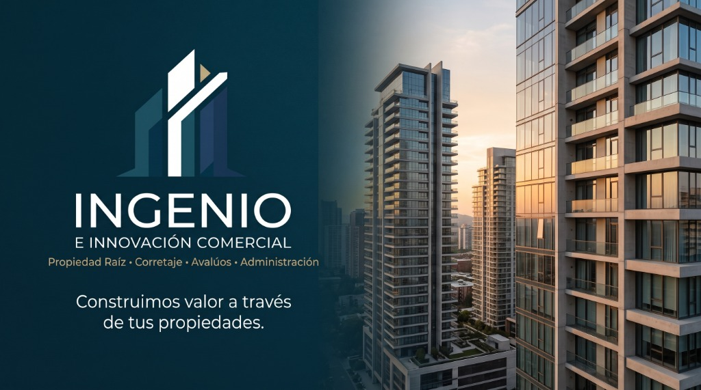

# INGENIO E INNOVACIÓN COMERCIAL S.A.S. - Portal Web Oficial

Plataforma digital premium, moderna y profesional desarrollada para la firma inmobiliaria **INGENIO E INNOVACIÓN COMERCIAL S.A.S.** de Medellín, Antioquia, Colombia.



---

## 🏛️ Identidad Corporativa Oficial

- **Razón Social:** INGENIO E INNOVACIÓN COMERCIAL S.A.S.
- **NIT:** 901113767-4
- **Dirección:** CALLE 34 # 64 -11, Medellín, Antioquia, Colombia
- **Teléfono Comercial:** +57 3206799857
- **Correo Electrónico:** soporte@ingenioinnovacion.online
- **Sitio Web:** [https://ingenioinnovacion.online/](https://ingenioinnovacion.online/)
- **Canal WhatsApp:** [https://wa.me/573206799857](https://wa.me/573206799857)

---

## 💼 Actividad y Soluciones Inmobiliarias

- **Negocios de propiedad raíz**
- **Corretaje inmobiliario**
- **Avalúos profesionales**
- **Administración de bienes inmuebles**
- **Arrendamiento**
- **Gerencia de proyectos de construcción y obras**

---

## 🎨 Sistema de Diseño y Paleta Oficial

| Color | Hex | Uso Principal |
|---|---|---|
| **Azul Oscuro** | `#0B1F33` | Fondo primario, hero, navbar, pie de página |
| **Azul Petróleo** | `#123B4A` | Fondos de contraste, tarjetas y detalles |
| **Blanco** | `#FFFFFF` | Fondos de lectura, superficies limpias |
| **Gris Piedra** | `#E8E5DF` | Superficies secundarias elegantes |
| **Gris Grafito** | `#20252B` | Textos de alta legibilidad |
| **Dorado Sutil** | `#C6A56A` | Acentos arquitectónicos y llamadas a la acción |

- **Tipografías:** *Cinzel* (títulos arquitectónicos y elegancia atemporal) y *Plus Jakarta Sans* (lectura moderna y ágil).

---

## 📁 Estructura del Repositorio

```
├── index.html                      # Página principal con 18 secciones
├── politica-privacidad.html        # Política legal bajo la Ley 1581 de 2012
├── terminos-y-condiciones.html     # Términos y condiciones de uso
├── assets/
│   ├── css/
│   │   ├── styles.css              # Sistema de estilos, tipografía y responsive
│   │   └── animations.css          # Animaciones de scroll reveal y efectos visuales
│   ├── js/
│   │   ├── main.js                 # Lógica de navegación, sticky navbar y formularios
│   │   └── properties-data.js      # Arquitectura modular para el catálogo inmobiliario
│   └── images/
│       ├── logo-ingenio.jpg        # Logotipo corporativo oficial
│       └── hero-banner.jpg         # Banner y composición arquitectónica
└── README.md
```

---

## 🚀 Despliegue y Ejecución

Al ser un proyecto estático optimizado, no requiere de compiladores pesados ni servidores Node.js:
1. Clonar el repositorio:
   ```bash
   git clone https://github.com/Santiago04-web/INGENIO-E-INNOVACI-N-COMERCIAL.git
   ```
2. Abrir `index.html` en cualquier navegador web o desplegar en servicios como **GitHub Pages**, **Vercel**, **Netlify** o cualquier hosting tradicional cPanel / Apache / Nginx.

---

© 2026 INGENIO E INNOVACIÓN COMERCIAL S.A.S. Todos los derechos reservados.
